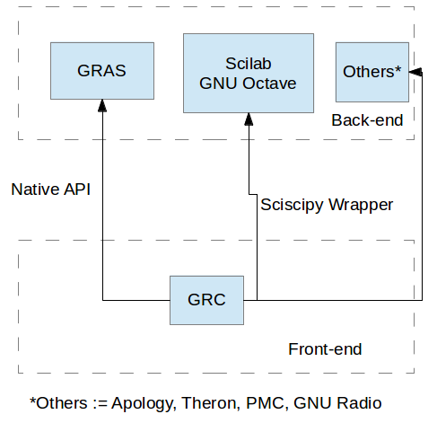

## Code Development

### Disruptive introduction to framework

This section is intended to be a quick introduction to architecture of Sandhi without getting into unnecessary details.

#### Sandhi Architecture
Sandhi is fork of GRAS(GNU Radio Advanced Scheduler) at core, but it also incorporates other modules like Sciscipy etc.
 
[GRAS](https://github.com/guruofquality/gras) is the application scheduler of Sandhi. It enables Sandhi to have closed-loop flowgraphs, dispatch threads, handle thread synchronization and much more. 
To know more, checkout it's [wiki](https://github.com/guruofquality/gras/wiki)

Essence of open-source development is to reuse the existing code and to build on top of it; several programs are generally written in high level programming languages such as Scilab/GNU-Octave since-
* It is easier to develop programs on them.
* Lot of libraries or toolboxes are availabe for such languages, which reduces the work. 
Hence, Sandhi provides a way to reuse **Scilab** programs as functional blocks through a wrapper called _Sciscipy_. Sciscipy is essentially a wrapper written in C language to provide a mechanism to call Scilab's computational engine through Python while taking care of datatype conversion.  
To know more, here's link to it's [official page](http://forge.scilab.org/index.php/p/sciscipy/)

#### Sandhi Interface
Sandhi uses GNU Radio (GR) V3.6 with GNU Radio Companion(GRC) as its front-end. [GNU Radio](http://gnuradio.org/redmine/projects/gnuradio/wiki) is open source software for implementing software radio visually through flowgraphs and blocks. A flow graph in GNU Radio is visual representation of data flow between two or more nodes, and these nodes are called blocks (which process the flowing data). Sandhi inherits this capability of intuitively implementing logic through flowgraph which makes it a good LabVIEW replacement.

### Coding a simple block
Since sandhi is still in beta stages, some of user-specific block may be missing; but this is not really a problem, since a user with limited python experience can create block himself/herself using Sandhi's framework. To follow a descriptive, step-by-step and conventional guide check GNU Radio's [Out of Tree Module](http://gnuradio.org/redmine/projects/gnuradio/wiki/OutOfTreeModules). A block can be either coded in python or C++; but given python is easier to start with, we prefer coding in python. This section will present a rapid but unconventional approach:

#### Overview
A block in Sandhi essentially requires two things:

1. A xml file (front end block description which is parsed by GRC to display that block.)
2. A python file (which describes how the block functions.)

Sandhi, by default, reads any xml block present in ~/.grc_gnuradio. Hence all our initial development will be done in the .grc_gnuradio folder.

#### Sample code
Sample code is availabe with annotations [here](code/.grc_gnuradio/)

